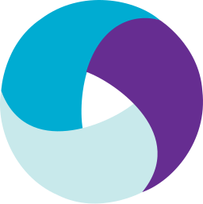

  

 
   

## 👋 there ! Thank your for your interest. ㊗️ 🙌

- 👀 **Interested in:** Java, Python, Javascript and SQL. 
- 🌱 **Current activity:** Learning everything.
- 💞️ **Looking for:** Any POC, finding custom solutions, scripting repetitive work.
- ⚡ **Fun fact:** Soccer fan and will go to camping & hiking. Riding motorcycle is fun.

### Connect with me:

&nbsp;&nbsp;

### Languages:

 

### Tools:

 
 
 

  
⚡ Recent GitHub Activity

  
<!--START_SECTION:activity-->
1. 🎉 Merged PR [#2](https://github.com/sonjoyg-kr/sonjoyg-kr/pull/2) in [sonjoyg-kr/sonjoyg-kr](https://github.com/sonjoyg-kr/sonjoyg-kr)
2. 💪 Opened PR [#2](https://github.com/sonjoyg-kr/sonjoyg-kr/pull/2) in [sonjoyg-kr/sonjoyg-kr](https://github.com/sonjoyg-kr/sonjoyg-kr)
3. 🎉 Merged PR [#1](https://github.com/sonjoyg-kr/sonjoyg-kr/pull/1) in [sonjoyg-kr/sonjoyg-kr](https://github.com/sonjoyg-kr/sonjoyg-kr)
4. 💪 Opened PR [#1](https://github.com/sonjoyg-kr/sonjoyg-kr/pull/1) in [sonjoyg-kr/sonjoyg-kr](https://github.com/sonjoyg-kr/sonjoyg-kr)
<!--END_SECTION:activity-->

  
⚡ GitHub Stats

 

---
➡ *Inspired By* : [codeSTACKr](https://github.com/codeSTACKr/codeSTACKr)
### Visitor Count &nbsp;&nbsp; 

